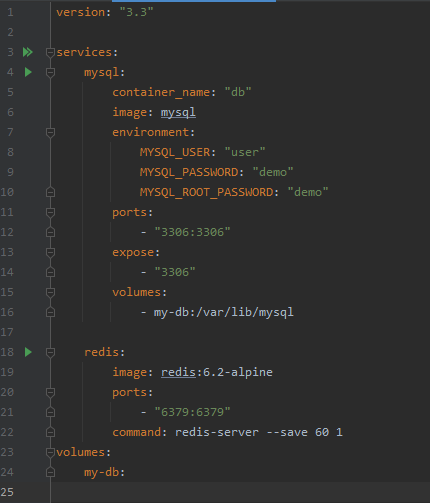

# Alkalmazott Menedzsment Rendszer

A program egy kezdetleges alkalmazott menedzsment rendszert reprezentál, amely több fő funkciót lát el.

**1. Autentikáció.** \
Végpontok meghívásához autentikáció szükséges. 
Az autentikált végpontoknál kötelezően tartalmaznia kell egy felhasználónevet és a hozzátartozó tokent.
Tokent bejelentkezés után kapja meg a felhasználó.

**Autentikált végpontok:**

  - **Felhasználók**
    - GET /rest/users/{from}/{numberOfItems} - Felhasználók listázása n-től n darabszámú entitás.
      - from = Listázás kezdő indexe.
      - numberOfItems = A listázás kezdetétől vett rekordok száma.
    - GET /rest/users/{userId} - Felhasználó azonosító alapján történő lekérése.
      - userId = Felhasználó azonosítója.
    - GET /rest/users/statements - Jogosultság alapján csoportosított felhasználók száma.
    - POST /rest/users - Felhasználó létrehozása.
    - POST /rest/users?userName=userName - Felhasználónév alapján történő lekérés.
      - userName = A felhasználó belépési neve.
    - PUT /rest/users/{userId} - Felhasználó azonosító alapján történő szerkesztése.
      - userId = Felhasználó azonosítója.
    - DELETE /rest/users/{userId} - Felhasználó azonosító alapján történő törlése.
      - userId = Felhasználó azonosítója.
  - **Kérelmek**
    - GET /rest/requests/{from}/{numberOfItems}/{status} - Kérelem listázása n-től n darabszámú entitás, kérelem státusza alapján.
      - from = Listázás kezdő indexe.
      - numberOfItems = A listázás kezdetétől vett rekordok száma.
      - status = A kérelem státusza.
        - **Kérelem státusza lehet:**
          - Remaining (Fennmaradó).
          - Accepted (Elfogadott).
          - Rejected (Elutasított).
    - GET /rest/requests/{requestId} - Kérelem azonosító alapján történő lekérése.
      - requestId = Kérelem azonosítója.
    - POST /rest/requests - Kérelem felvétele.
    - PUT /rest/requests/{requestId} - Kérelem azonosító alapján történő szerkesztése.
      - requestId = Kérelem azonosítója.
    - DELETE /rest/requests/{requestId} - Kérelem azonosító alapján történő törlése.
      - requestId = Kérelem azonosítója.

**Nem autentikált végpontok:**

  - /auth
    - POST /login - Bejelentkezés.
    - POST /registration - Regisztráció.

Bejelentkezéskor kapott token **24 óráig él**, utána ismét autentikáció szükséges.

**2. Jogosultság kezelés** \
A lekérdezések eredménye nagymértékben függ a felhasználó jogosultságától.
Különböző jogosltságú felhasználók különböző eredményű válaszokat kapnak.
Jelenlegi jogosultságok és eredményeik:

  - Admin - Összes rekord.
  - Cég - Hozzátartozó alkalmazottak rekordjai.
  - Alkalmazott - Felhasználók listázásánál a hozzárendelt cég összes alkalmazottja. Kérelem listázásánál a saját kérelmek.

**3. Fiók kezelése** \
Szükség esetén módosíthatjuk a fiókunk adatit.

A következő mezők megadása szükséges:

  - Valódi név (Cég esetén ez cégnév),
  - Felhasználónév,
  - Telefonszám,
  - E-mail cím,
  - Pozíció (Alkalmazotti fiók módosítása esetén kötelező),
  - Jelszó (Opcionális csak, ha módosítani akarjuk)

# A program használatához szükséges programok

A program telepítéséhez az `Apache Maven 3`-as verziója szükséges, 
valamint a program futtatásához a Java JDK 17-es verziója szükséges!

A Java `JDK 17`-es verziója az alábbi linken elérhető: [JDK 17](https://www.oracle.com/java/technologies/downloads/#java17)

Az `Apache Maven 3.8.2`-es verziója az alábbi linken elérhető: [Apache Maven 3.8.2](https://maven.apache.org/docs/3.8.2/release-notes.html)

# Használati útmutató

A program telepítése az `mvn clean install` paranccsal lehetséges a program főkönyvtárában.

A program sikeres futtatásához szükségünk van egy MySQL / Redis szerverre is.
Ezek futtatása megoldható Docker használatával. [Docker telepítése](https://www.docker.com/)

Az adatbázis táblák automatizáltan jönnek létre futásidőben, így ezzel nem kell foglalkozni.

Az `etc/ems-docker/docker-compose.yml` állomány futtatásával ezek a szerverek automatikusan létrejönnek.

Az állomány futtatható a képen lévő zöld nyílra kattintva (Pl: jetbrains IntelliJ IDEA-ban) [Intelijj IDEA telepítése](https://www.jetbrains.com/idea/)
vagy a következő terminál paranccsal: `docker-compose -f docker-compose.yml up` az ems-docker könyvtárban.

A terminálos futtatáshoz elsősorban is telepítenünk kell a docker composert. [Segítség a telepítéséhez](https://github.com/docker/compose).

Folyamatok elvégzése után a program futtatása a /target mappa alatt `java -jar ems-app-0.1.0-SNAPSHOT.jar` paranccsal lehetséges.

# Felhasznált technológiák

  - Java 17
  - Spring Boot 5.3.9,
  - Maven 3.8.2,
  - JPA 2.5.4,
  - Docker 20.10.10,
  - Redis Docker Image 6.2.6,
  - MySQL Docker Image 8.0.27-1debian10,
